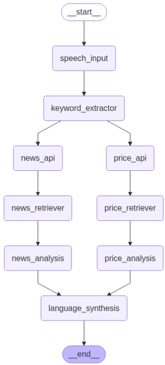

# 🎤 Financial Analysis System



AI-powered real-time financial market analysis with voice and text input capabilities.

## ✨ Features

- 🎤 **Voice Input** - Real-time speech processing via OpenAI Whisper
- 📈 **Multi-Source Data** - AlphaVantage & Yahoo Finance integration  
- 🧠 **AI Analysis** - Powered by Groq/Llama 70B for intelligent insights
- 🔍 **Vector Search** - ChromaDB for semantic document retrieval
- 📊 **Interactive Dashboard** - Real-time charts and visualizations
- 🏗️ **Microservices** - Modular agent-based architecture
- 🐳 **Docker Ready** - Containerized deployment

## 🚀 Quick Start

### Prerequisites
- Python 3.11+
- API Keys: OpenAI, Groq, AlphaVantage

### Local Setup
```bash
# Clone repository
git clone https://github.com/yourusername/financial-analysis-system.git
cd financial-analysis-system

# Setup environment
cp .env.example .env
# Add your API keys to .env file

# Install dependencies
pip install -r requirements.txt

# Run Streamlit app
streamlit run src/ui/app.py
```

### Using Microservices
```bash
# Start agents microservice
cd src/microservices
python main.py  # Runs on port 8001

# In another terminal, start main app
streamlit run src/ui/app.py  # Runs on port 8501
```

## 🌐 Deployment

### Streamlit Cloud : https://app-cloud-assistance-xibc2oaozz8ic6mbt8ryqk.streamlit.app/
    

### Docker Deployment
```bash
# Build and run with Docker Compose
docker-compose up -d --build

# Access services:
# Streamlit UI: http://localhost:8501
# Microservices API: http://localhost:8001
```

### Local Development
```bash
# Install development dependencies
pip install -r requirements-dev.txt

# Run tests
pytest tests/

# Code formatting
black src/
flake8 src/
```

## 📋 Configuration

| Environment Variable | Required | Description |
|---------------------|----------|-------------|
| `OPENAI_API_KEY` | ✅ | OpenAI API for Whisper speech processing |
| `GROQ_API_KEY` | ✅ | Groq Cloud API for LLM inference |
| `ALPHAVANTAGE_API_KEY` | ✅ | Stock market data from AlphaVantage |

## 🏗️ Architecture

```
src/
├── agents/              # Modular analysis agents
├── core/               # Shared models and configs  
├── microservices/      # API endpoints for agents
├── orchestration/      # LangGraph workflow
├── services/          # External API integrations
└── ui/                # Streamlit interface
```


**Key Demo Features:**
- Voice input recognition
- Real-time market data fetching
- AI-powered analysis generation
- Interactive dashboard visualization

## 🛠️ Usage Examples

### Voice Input
1. Click "🎤 Start Recording" in the UI
2. Speak your query: *"What's the latest on Apple stock?"*
3. Get comprehensive analysis with charts and insights

### Text Input
```python
# Example query
"Analyze Tesla stock performance and provide investment recommendations"
```


## 🤝 Contributing

1. Fork the repository
2. Create feature branch (`git checkout -b feature/amazing-feature`)
3. Commit changes (`git commit -m 'Add amazing feature'`)
4. Push to branch (`git push origin feature/amazing-feature`)
5. Open Pull Request
---
⭐ Star this repository if you find it helpful!
